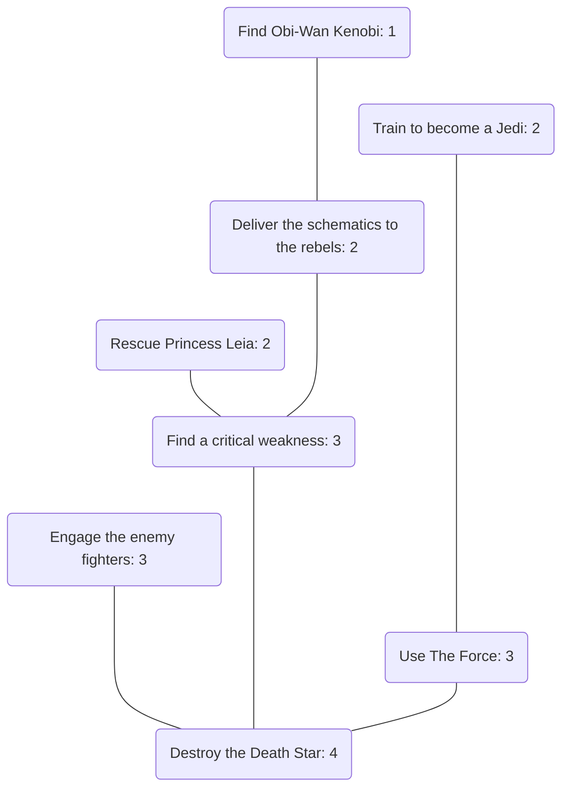

# Temporal Mechanics

When things go awry with someone's car, they call their mechanic.  
When things go awry with the timeline, they call you!

---

## Characters
There are two kinds of characters.
   1. __Player Characters (PCs):__
      The PCs are the heroes of the story.
      Each PC is controlled by a single player throughout the game.
   2. __Non-Player Characters (NPCs):__
      The NPCs are everybody else.
      NPCs can be controlled by any of the players as the need arises during the game.

## Traits
Characters are described by a set of _traits_.
A trait is simply an [aspect](#aspects) that is assigned to a player character.
Five traits are assigned to each PC during character creation.
Each character should be assigned one trait from each of the following categories:
   - __Occupation:__
     An aspect that describes a character's profession, hobbies, or other interests.
     This aspect should be the character's answer to the question "What do you do?"
   - __Physical or Mental Characteristic:__
     An aspect that describes a character's body and/or mind.
     Are they a genius?
     Are they clumsy?
     Are they particularly strong?
     This aspect is a chance to capture that kind of detail.
   - __Psychological Characteristic:__
     An aspect that describes a character's personality.
     These characteristics could be beneficial or detrimental; the best are a little bit of both.
     This aspect should reveal something about how the character thinks about the world around them.
   - __Relationship:__
     An aspect that describes a character's connection with another character.
     The game's story should test the relationship between the two characters.
     This aspect speaks volumes about the character's personal history.
   - __Affiliation:__
     An aspect that describes a character's connection with an organisation.
     Such an organisation should be a prominent feature of the game's story.
     Affiliations tend to be much more transactional than relationships.
     This aspect implies both a set of benefits that the character enjoys and a set obligations that the character incurs as a result of their affiliation.

---

## Acts
Each adventure is subdivided into three acts:
   1. __Setup:__
      The first act is set in the future.
      In this act the characters relive a catastrophic past event and prepare a warning about that event to send back to their former selves.
      The players first play through a [flashback scene](#flashback-scene) in which they describe what happened in the game's original timeline and how their characters were affected.
      The players then build a [story tree](#story-tree) describing the events that led up to the climax and that, if changed, could make it easier to alter the timeline for the better.
   2. __Confrontation:__
      The second act is set in the present.
      In this act, the characters receive the warning sent by their future selves and try to prevent the prophesied catastrophe.
      The players play through the [story scenes](#story-scenes) described in the story tree that they created in the previous act. Each story scene culminates with a [check](#checks) to determine its outcome.
   3. __Resolution:__
      The third act is again set in the future.
      In this act, the characters learn the consequences of their meddling with the timeline.
      The players play through a [flashforward scene](#flashforward-scene) in which they learn about how their actions will change the future.

---

## Story Scenes
Each story scene is subdivided into three phases:
   1. __Investigate:__
      In this phase, the characters explore the scene.
      The players identify/assign aspects to the people/places/things that their characters encounter during this phase.
   2. __Influence:__
      In this phase, the characters attempt to alter the timeline.
      The players make a [check](#checks) to determine the outcome of the scene.
   3. __Interpret:__
      In this phase, the characters find out what happened as a result of their actions.
      The players describe the narrative consequences of the outcome of the encounter's influence roll.

## Flashback Scene
Test

## Flashforward Scene
Test

## Time Limits
Each scene is played out in ten minutes of real time.

---

## Aspects
An aspect is a word or short phrase that describes something noteworthy about a person, place, or thing in the game's story.
Aspects can be thought of as adjectives while the objects that they describe can be thought of as nouns.
Each aspect is _attached_ to a single object.

## Matching Aspects
Characters and environments both have [aspects](#aspects).
Character aspects are generally created before the game starts and describe who the characters are and what they can do.
Environment aspects are generally created during the game and describe the people, places, and things that the characters encounter.
A pair of _matching aspects_ is a set of two aspects, one character aspect and one environment aspect, that together allow the characters manipulate a scene to their advantage.

#### Example
Suppose an NPC who needs to be prevented from catching a flight has the aspect "Argumentative".
In this case, "Argumentative" itself might be the best match that could appear in the characters' aspect list.
The NPC could be drawn into an argument with the PCs or even provoked into doing something that would get them kicked off of the flight.

If instead the NPC had the the aspect "Meek", then character aspects like "Aggressive", "Demanding", or even simply "Angry" might be appropriate matches.
The NPC could be simply intimidated by the PCs and coerced into doing what the PCs want them to do.

---

## Checks
A _check_ is used to determine the outcome of a scene.
To make a check, the players will:
   1. __Compute the check's difficulty rating:__
      The difficulty rating of a check depends on the [depth](#depth) of the current scene.
      The difficulty rating of an scene with depth _d_ is _4 - d_.
   2. __Assemble a dice pool:__
      A dice pool is made up of one or more six-sided dice (d6s).
      One die is added to the dice pool for each pair of [matching aspects](#matching-aspects) that the players discover during the investigation phase of the scene.
      In addition, one _reward die_ is added to the dice pool for each scene immediately upstream of the current scene that was resolved successfully.
   3. __Roll the dice:__
      The dice in the dice pool are _exploding dice_.
      That is, for every die that yields a value of `6` one additional die is added to the dice pool and rolled.
      The values of all the rolls contribute to the result of the check.
   4. __Determine the result of the roll:__
      Any die that yields a value of `1`, `2`, or `3` is a _miss_.
      Any die that yields a value of `4`, `5`, or `6` is a _hit_.
      The result of a roll is the total number of hits.
   5. __Compare the result of the roll to the check's difficulty rating:__
      If the result of the players' roll exceeds or meets the check's difficulty, then they _succeed_ at the check and their characters accomplish their goal.
      Otherwise, the players _fail_ at the check and their characters do not accomplish their goal.

#### Example
   The players are making a check to determine the outcome of a scene that has a depth of _d = 1_.
   The difficulty rating of the scene is _3_.
   The players discovered three pairs of matching aspects during the investigate phase of scene and earned two reward dice in the scenes immediately upstream of the current scene.
   Therefore, the dice pool consists of five dice.
   When rolled, these dice yield the values {`3`, `6`, `5`, `1`, `6`}.
   Because two of the dice yielded a value of `6`, two additional dice are added to the pool.
   When rolled, these dice yield the values {`2`,`6`}.
   Because one of the dice yielded a value of `6`, one additional die is added to the pool.
   When rolled, this die yields the value {`4`}.
   In total, this roll yields the values {`3`, `6`, `5`, `1`, `6`, `2`, `6`, `4`}.
   The result of this roll would be five hits.
   The number of hits exceeds the difficulty rating so the players would succeed at the check.   

---

## Story Tree
The players describe a sequence of significant events by creating a _story tree_.
A story tree is a collection of scenes arranged in a tree-like structure.
Every story tree has a climactic scene and one or more other scenes.
These other scenes are _upstream_ of the climactic scene.
That is, they occur earlier in the timeline of the game's story than does the climactic scene.

To create a story tree, the players should:
   1.  __Create a climactic scene:__
      This scene should be defined by the actions that the characters will take to try avert the catastrophe described in the [flashback scene](#flashback-scene).
   2. __Create additional scenes__:
      To create additional scenes, the players should repeatedly:
         1. __Choose an existing scene__:
            The chosen scene can be any scene with depth _d < 3_.
         2. __Create a new scene:__
            The outcome of the new scene should directly affect the characters' ability to influence the outcome of the existing scene.
            The new scene will be _immediately upstream_ of the existing scene and the two scenes are connected via an _edge_.

## Depth
The climactic scene always has a depth of _d = 0_.
The depth of other scenes is the number of edges between that scene and the climactic scene.

#### Example

---

## Technobabble
Any good work of science fiction needs a modicum of technobabble to grease the narrative wheels a bit and facilitate the suspension of disbelief required by the genre.
   1. __Tachyonic Antitelephone:__
      Characters send messages from the future back to their past selves using a _Tachyonic Antitelephone_.
      A tachyonic antitelephone can only be used to send messages to a past version of itself.
      As such, no messages can be sent to a time before the first tachyonic antitelephone was created.
      These devices are rare, expensive, and incredibly energy hungry.
      Therefore, any messages sent by an tachyonic antitelephone are necessarily short.

   2. __Temporal Inertia:__
      The timeline is robust.
      Altering the course of history is difficult and fraught with peril.
      The more significant an event is the more difficult it is to affect and the more serious the consequences for failure.
      This property is known as _temporal inertia_.  
